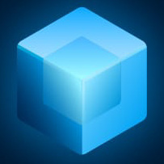

<div align="center">
  

  # TSrect OCR
<p align="center">

  <!-- Live Demo -->
  <a href="https://br1jm0h4n.github.io/TSrect-ocr/">
    
  </a>

  <!-- Animated Gradient Style -->
  
  
  

  <!-- Repo Stats -->
  
  
  
  

  <!-- Features -->
  
  
  
  

</p>

  ### ✨ Elegant, browser-based OCR for **Images + PDFs**

  <p>
    Extract text directly in your browser using <b>Tesseract.js</b> + <b>PDF.js</b>.<br/>
    No backend required. No uploads. Your files stay local.
  </p>
</div>

---

## 🌟 Why TSrect OCR?

TSrect OCR is a modern, single-page OCR tool designed for speed and simplicity:

- 🖼️ OCR from **images** via drag-and-drop, click-to-upload, or paste.
- 📄 OCR from **multi-page PDFs** (each page is rendered and recognized).
- 🌐 **In-browser only** processing (privacy-friendly workflow).
- 🔤 Built-in language switching (**English** + **Hindi**).
- 📊 Live progress feedback while recognition runs.
- 🧾 Combined full-document view with **TXT download**.

---

## 🧠 Tech Stack

- **Frontend:** HTML, CSS, Vanilla JavaScript
- **OCR Engine:** [Tesseract.js]
- **PDF Rendering:** [PDF.js]
- **Language Data:** Local traineddata files in `langData/`

---

## 🚀 Quick Start

Because this project uses worker files and local assets, run it with a local static server.

### 1) Clone the repository

```bash
git clone <your-repo-url>
cd TSrect-ocr
```

### 2) Start a local server

Choose one:

```bash
# Python
python3 -m http.server 8080
```

```bash
# Node (if you have serve)
npx serve .
```

### 3) Open in browser

- Python server: `http://localhost:8080`
- Serve default: URL printed in terminal

---

## 🛠️ How to Use

1. Drop an image/PDF into the upload area (or click to choose a file).
2. Select OCR language from the language dropdown.
3. Wait for recognition to complete (progress bar updates live).
4. Copy text from per-page text boxes.
5. For multi-page documents, use the combined text area and download as `.txt`.

---

## 📁 Project Structure

```text
TSrect-ocr/
├── index.html                 # App UI and styles
├── index.js                   # OCR, PDF parsing, interactions
├── head.jpg                   # Project icon used in README/UI
├── langData/
│   ├── eng.traineddata.gz     # English model
│   └── hin.traineddata.gz     # Hindi model
├── tesseract.js/              # Tesseract runtime + worker
├── tesseract.jscore/          # Tesseract core files
├── pdf.min.js                 # PDF.js library
└── pdf.worker.js              # PDF.js worker
```

---

## 🔐 Privacy Notes

- OCR runs in the browser; files are not sent to a remote server by this app.
- If you host this app publicly, consider HTTPS and appropriate CSP headers.

---

## 💡 Ideas for Future Enhancements

- Additional OCR languages
- Export to DOCX/PDF
- Text region selection
- Theme toggle and keyboard shortcuts
- Search inside extracted document text

---

## 🤝 Contributing

PRs and issues are welcome! If you contribute, please:

- Keep the app lightweight and dependency-minimal.
- Prefer browser-native APIs and readable vanilla JS.
- Test with both image and PDF inputs.

---

## 📜 License

Add your preferred license (MIT/Apache-2.0/etc.) in a `LICENSE` file.

---

<div align="center">
  Built with ❤️ for clean, local-first OCR workflows.
</div>

[Tesseract.js]: https://github.com/naptha/tesseract.js
[PDF.js]: https://mozilla.github.io/pdf.js/
